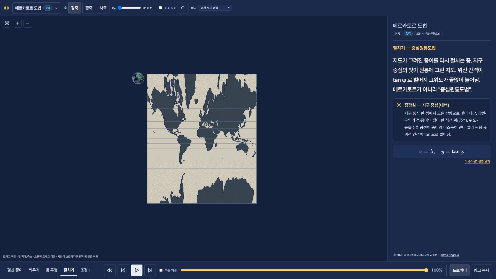
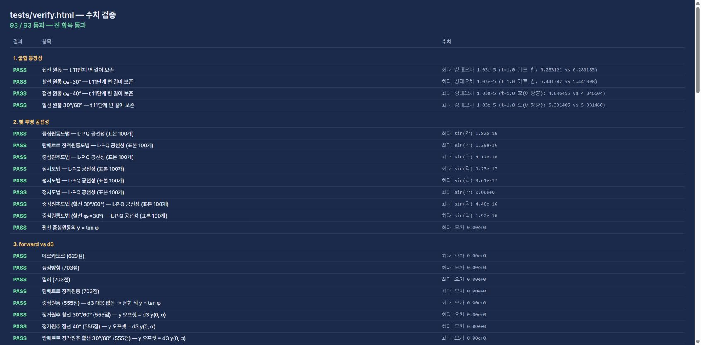

# CHANGELOG

## 2026-09-21 — 모든 종이의 지구 가림·우주 배경·비교 기본값 확인

- `js/scene/paper.js`: 실제 pipeline 종이 geometry를 공유하는 깊이 전용 패스 추가(renderOrder 19). 광선 표현 뒤, 지구 표면 앞에 실행하여 내부 광선은 유지하면서 종이 뒤 지구만 가림. 접선/할선/원통/원추/평면 및 굽힘·회전 모두 동일한 실제 깊이 기준. 할선 돌출부는 유지.
- `js/scene/globe.js`: 지구와 경위선 순서를 20/21로 통일. 표준위선 주변만 직접 잘라내던 임시 셰이더 제거. `js/scene/contact.js`: 불필요해진 지구 회전 uniform 제거. 얇은 접촉 표시는 유지.
- `js/scene/space.js`: 청흑색 공간·은은한 별 480개를 초기화 시 CanvasTexture 한 장으로 생성. 애니메이션·별 메시 없이 배경으로 사용. `js/scene/camera.js`: 씬 카메라 리그 초기화에서 배경 연결. main 변경 없음.
- 비교 기본값은 `state.compare=null`로 이미 '겹쳐 보기 없음'. `http://localhost:8766/` 초기 화면 선택 상태 확인. 단, Equal Earth/구드 조정 단계의 자동 비교 3곳은 읽기 전용 derivations에 있어 변경 허용 요청 중. 공유 URL의 compare 지정은 존중.
- 비교 포인트: 메르카토르 접선·빛 투영 55%에서 종이 뒤 지구 색이 사라지고 광선/지도 선 유지. 원추 20°/50° 할선에서는 종이 바깥 지구 돌출 유지. 평면 접촉도 실제 종이로 가림. 초기 화면에서 흰 종이와 청흑색 별 배경 대비 확인.
- `screenshots/space-tangent-project.png`, `screenshots/space-conic-secant.png`, `screenshots/space-default-no-comparison.png`, `screenshots/verify-93-space-occlusion.png`: 변경 및 93/93 검증 증빙. `CHANGELOG.md`: 인계 기록.
- npm 및 브라우저 93/93 통과. 콘솔 셰이더 오류 없음. 60fps 실측 미확인; 깊이 패스 1회 추가, 기존 geometry 공유. 127.0.0.1 기존 탭에서 모듈 캐시가 남아 localhost:8766으로 확인; 기존 탭은 Ctrl+F5 필요.
- 횡축 instant URL 검사 중 과도하게 확대된 시점 관찰. 이번 카메라 수정은 배경 초기화뿐이며 자동 맞춤 로직은 변경하지 않음. 해당 시점 문제는 추가 진단 필요.

## 2026-09-21 — 접촉선 두께 축소·지구 표면 직접 가림

- `js/scene/contact.js`: 접촉 표시용 공통 셰이더와 uniform 갱신 추가. 상태는 읽기만 하며 위치 계산 없음. 표준위선 높이와 프레임 회전으로 접촉부 판별.
- `js/scene/globe.js`: 접촉부에서 지구 표면과 경위선을 함께 discard. 기존 깊이 마스크만으로 앞쪽 지구를 가리지 못하던 한계 보완. 접촉부 밖 할선 돌출 유지.
- `js/scene/paper.js`: 접촉 표시를 구와의 반지름 차 대신 표준위선 높이 거리로 계산하여 접선에서 두꺼운 띠가 되는 현상 제거. 흰색 가림 영역과 화면 약 1px 표시선을 분리. 종이 geometry와 pipeline 위치는 그대로 유지.
- 비교 화면: 원통 φ₀=0°, 빛 투영 55%에서 이전 굵은 황동 띠가 얇은 선으로 변경. φ₀=30°, 씌우기 100%에서 위아래 경계 지구 표면 가림 및 중앙 돌출 유지.
- `screenshots/contact-thin-tangent.png`, `screenshots/contact-thin-secant.png`, `screenshots/verify-93-contact-thin.png`: 화면 및 검증 증빙. `CHANGELOG.md`: 변경 기록.
- npm 및 브라우저 검증 93/93 통과. 셰이더 콘솔 오류 없음. main·원격 및 읽기 전용 파일 변경 없음. 60fps 실측 미확인 유지.

## 2026-09-21 — 종이·지구 접촉 표시

- `js/scene/paper.js`: pipeline이 만든 종이 geometry를 공유하는 접촉 전용 패스 추가. 단위구와 맞닿는 좁은 부분만 불투명 황동색으로 표시하고 깊이를 기록하여 반투명 지구가 경계를 덮지 않게 함. 종이 밖으로 나온 할선 지구는 유지. 씌우기 완료 근처에서 표시되며 펼치기 시작 때 사라짐. 평면 투영 완료 시 지구 이동 전에 표시 제거.
- 정점·도법·상태 머신 변경 없음. 종이 geometry 재사용, 접촉 중 draw call 1개 추가. 1080p 60fps 실측은 여전히 미확인.
- 비교: 원통 φ₀=30°, 씌우기 100%에서 돌출부 위아래 경계에 접촉 표시. 원추 φ₁=20°/φ₂=50°도 두 경계 표시. 빛 투영 중 접선 원통에서는 적도 접촉부가 지구 색과 분리됨.
- `screenshots/contact-secant.png`, `screenshots/contact-conic.png`: 수정 화면. `screenshots/verify-93-contact.png`: 브라우저 검증 통과 캡처.
- `npm.cmd test`, `tests/verify.html` 93/93 통과. 브라우저 셰이더 오류 없음. `CHANGELOG.md`: 이번 변경 기록.
- 배경 조사: 현재와 원본 main 모두 `js/main.js`의 단색 `0x14213d`. 별 배경 삭제 이력은 이번 변경에 없음. 우주 배경 추가 여부는 사용자 응답 대기, 배경 변경 없음.

## 2026-09-21 — 헤더 이름 변경

- `index.html`: 좌상단 브랜드 문구를 `Projection 3D`로 변경. 브라우저 탭 제목과 설명은 유지.
- `CHANGELOG.md`: 변경 기록. `npm.cmd test` 93/93 통과.

## 2026-09-21 — 흰 종이로 변경

- `js/scene/paper.js`: 종이 기본색·자체 발광색을 흰색으로 변경. 뒷면의 황색 보정을 중립 명암으로, 가장자리의 베이지색을 회색으로 변경. 거친 입자 질감·투영 위치·조명 동작 유지.
- `CHANGELOG.md`: 변경 기록. `npm.cmd test` 93/93 통과.

## 2026-09-21 — 티소 정보 아이콘 원복

- `css/style.css`: 티소 지표 정보 버튼(`.ibtn`)만 기존 20×20px 원형으로 복원. 공통 도구 버튼의 최소 높이·너비를 덮어쓰므로 프로젝터 모드에서도 원형 유지. 다른 버튼과 팝오버 동작 변경 없음.
- `CHANGELOG.md`: 요청 및 변경 기록. `npm.cmd test` 93/93 통과.

## 2026-09-21 — 단계 C 후속: 공통 버튼·담백한 단계 탭·거친 종이

- `css/style.css`: 헤더와 푸터 버튼을 같은 4px 모서리·1px 테두리·무그림자로 통일. 일반 높이 36px, 프로젝터 44px. 재생 버튼도 같은 크기로 맞추고 밝은 중립색으로 구분. 단계 버튼은 박스/노란 배경/두꺼운 강조선을 제거한 텍스트 탭으로 변경; 현재 단계만 밝은 글자와 2px 밑줄로 표시.
- `js/scene/paper.js`: 이전 펄프 얼룩과 긴 섬유 무늬 제거. 작은 불규칙 입자에 밝고 어두운 면을 짝지어 거친 드로잉 용지 같은 무광 표면으로 변경. 축소 시 입자 대비 감쇠. 표면 색 연출만 변경하며 pipeline 위치와 법선 계산은 유지.
- `screenshots/polish-v3-dry-paper.png`, `screenshots/verify-93-v3.png`: 디자인과 검증 캡처. 이전 질감/버튼은 `polish-v2-paper-ui.png`와 비교.
- `CHANGELOG.md`: 이번 인계 기록. 상태 머신·수학·tests·UI 연결 로직 수정 없음.
- 확인 화면: `http://127.0.0.1:8766/?p=mercator&stage=unroll&t=1&instant=1&projector=1`. 1920×1080에서 헤더 축 버튼·푸터 재생 버튼 모두 높이 44px, 문서 가로 넘침 없음 확인.
- `npm.cmd test` 및 `tests/verify.html` **93/93 통과**, diff 검사 통과. 60fps 실측 미확인 사항은 이전 기록과 같음.

## 2026-09-21 — 단계 C 후속: 종이 질감과 시각적 우선순위

사용자 요청에 따라 종이 질감 강화와 디자인 개선 1~4번을 모두 적용. 기존 `visual-polish` 브랜치에서만 작업하며 push 없음.

| 바꾼 파일 | 변경과 비교 포인트 |
|---|---|
| `js/scene/paper.js` | 단일 미세 노이즈 대신 펄프 얼룩·비스듬한 섬유·미세 결을 겹친 절차적 질감. 종이의 넓은 빈 영역에서 질감이 드러나도록 색 변화를 강화. 화면보다 작은 결은 fwidth로 평균화해 축소 시 반짝임 억제. 외부 텍스처·추가 메시·정점 변형 없음. |
| `js/scene/rays.js` | 광원 쪽 정점색은 18%, 끝점은 100%로 보간해 광원 부근 중첩 과노출 완화. 중심선 불투명도 0.64→0.48, 글로우 0.10→0.045. 내핵·선광원·평행광 원판의 글로우도 감소. 2.2px 굵기와 pipeline 끝점 유지. |
| `js/scene/mapLayer.js` | 육지 채움만 청회색 `#536b80`로 변경. 해안선은 기존 네이비 잉크로 유지해 채움·해안선·경위선 구분 강화. |
| `css/style.css` | 도법명/배지보다 현재 단계·핵심 자막이 먼저 보이도록 크기·간격·대비 조절. 상세 광원 설명은 차분한 배경과 보조 텍스트 색. 단계/재생/유틸 묶음 사이 간격·구분선, 큰 재생 버튼, 활성 단계 밑줄, 키보드 포커스 표시. 프로젝터 버튼/숫자 확대. 860px 이하에서는 재생부 줄바꿈. |
| `screenshots/polish-v2-paper-ui.png`, `screenshots/polish-v2-light.png`, `screenshots/verify-93-v2.png` | 이번 변경의 종이·UI, 평행광, 검증 통과 캡처. |
| `CHANGELOG.md` | 변경·검증 기록. |

Frontend-design 지침을 기존 네이비·미색·금빛 팔레트와 수업용 가독성에 맞춰 적용. 자막 문구와 UI 상태 연결 로직 변경 없음. 수학·geometry·state·tests·main 파일 변경 없음.

- 종이/지도/UI 비교: `http://127.0.0.1:8766/?p=mercator&stage=unroll&t=1&instant=1&projector=1` — [화면](screenshots/polish-v2-paper-ui.png).
- 과노출 비교: `http://127.0.0.1:8766/?p=orthographic&stage=project&t=0.6&instant=1` — [이전](screenshots/parallel-rays.png), [개선](screenshots/polish-v2-light.png). 하단 광원 원판의 하얀 뭉침과 광선의 색 분리 확인.
- `npm.cmd test`, `tests/verify.html` 모두 **93/93 통과**. JS 구문·diff 공백 검사 통과.
- 1920×1080 프로젝터 모드에서 가로 넘침 없음, 하단 버튼 높이 범위 정상. 390×844에서 재생부가 370px 폭 안에서 줄바꿈하며 화면 안에 위치함을 확인. 실제 투사 환경의 가독성과 60fps는 이전 절의 미확인 사항 유지; 이번 질감 변경 후 전체 FPS는 재측정하지 않음.

## 2026-09-21 — 단계 C 시각 연출 (`visual-polish`, Codex)

`9b06b1e`에서 새로 clone한 `proj3d-astra`의 로컬 브랜치에서 작업. 원격 push 없음. 기존 `projection3d` 작업본의 파일 수정 없음. **시각 구현과 수치 검증 완료, 실제 프로젝터 60fps 승인 조건은 미확인**.

### 바꾼 파일과 요약

| 파일 | 변경 |
|---|---|
| `js/scene/rays.js` | 1px LineSegments → 화면 공간 2.2px 중심선 + 7px 약한 가산 글로우. 두 LineSegments2가 하나의 끝점 버퍼를 공유. 매 프레임 재할당 없음. 내핵 글로우 크기 1.1 → 1.35. `paperPosition` 호출과 기존 L→Q 앞머리 계산은 유지. |
| `js/scene/paper.js` | 미색 Lambert 재질에 약한 자체 발광, 미세한 절차적 종이 결, 뒷면 색 구분과 가장자리 음영. 위치 변형 없음. 빛 단계에서는 s와 무관한 종이 형태의 중복 갱신 생략. 도법·매개변수·도메인·굽힘이 바뀌면 재계산. |
| `js/scene/mapLayer.js` | 도달부의 밝은 띠와 smoothstep 잉크 전환 강화. PLAN 10.5 방식으로 빛 단계 육지 격자의 보간을 GPU로 이동: CPU pipeline이 종이 끝점·법선을 계산하고 광원 거리 attribute를 전달, 셰이더는 같은 s_v와 lerp만 수행. 원본 경위도 보관 유지. 씌우기·펼치기·수학 조정·절개는 기존 CPU pipeline 사용. 저사양 전환 시 버퍼 재생성. |
| `js/scene/camera.js` | 지구본이 축소되며 뒤쪽 여유 공간 → 왼쪽 경계 밖 → 종이 앞면 → 좌측 상단으로 이동. 위치의 직선 감쇠 대신 경로 진행도 감쇠로 모서리 지름길 방지. 카메라 방향과 거리를 별도로 보간하고 중간 자세의 종이 경계 상자를 맞춰 원뿔 전환 시 잘림 완화. |
| `screenshots/*.png` | 원본/변경 후 광선, 원뿔 펼치기, 평행광, 구드 최종 지도, 93/93 검증 통과 캡처. |
| `CHANGELOG.md` | 이번 변경·비교 방법·검증·성능 한계 기록. |

Frontend-design 스킬의 색·재질·움직임 지침을 기존 네이비/미색/따뜻한 노랑 안에서 적용. UI·자막·상태 연결 변경 없음. `js/projections/`, `js/geometry/`, `js/state.js`, `tests/`, `js/ui/`, `main.js`, 의존성 명세 모두 변경 없음.

### 비교 포인트

아래 경로는 새 작업본 서버 `http://127.0.0.1:8766/` 기준. `instant=1`은 정지 화면 비교용이며 실제 이동 경로는 이 옵션 없이 재생/역재생으로 확인.

| 화면 | 확인할 변화 | 캡처 |
|---|---|---|
| `?p=mercator&stage=project&t=0.72&instant=1` | 광선 중심선 두께, 옅은 외곽 글로우, 고위도에 도달하는 금빛 띠 | [변경 전](screenshots/rays-before.png), [변경 후](screenshots/rays-after.png) |
| `?p=centralConic&stage=unroll&t=0.72&instant=1` | 부채꼴 전체가 화면 안에 들어오는 중간 구도와 좌측으로 우회하는 지구본 | [원뿔 펼치기](screenshots/cone-unroll.png) |
| `?p=orthographic&stage=project&t=0.60&instant=1` | 평행광의 굵기·직선성, 종이에 닿기 전 이동 중인 지도 | [평행광](screenshots/parallel-rays.png) |
| `?p=goodeHomolosine&stage=adjust&step=2&t=1&instant=1&tissot=1` | 완성된 종이의 미색·잉크 대비, 절개선과 티소 유지 | [구드 최종](screenshots/goode-final.png) |

변경 전 광선 캡처는 이 clone의 원본 커밋 `9b06b1e`를 ignored `node_modules/visual-baseline/`에 풀어 같은 서버에서 촬영. 처음 접속한 8765 응답은 기존 서버와 충돌해 최종 비교 근거에서 제외. `npm run serve` 실행 후 충돌을 확인해 새 서버만 종료하고, 동일한 Python HTTP 서버를 8766에서 실행. 기존 서버는 그대로 둠.

### 검증

- `npm.cmd install` 완료(취약점 0), `npm.cmd test`: **93/93 통과**. Windows PowerShell 실행 정책 때문에 npm.ps1 대신 npm.cmd 사용.
- `http://127.0.0.1:8766/tests/verify.html`: **93 / 93 통과 — 전 항목 통과**. [통과 화면](screenshots/verify-93.png).
- 빛 도법 6종 × 경위도 표본 × 진행도 5개, 총 5,700개에 대해 Float32 끝점 attribute 기반 보간식과 `pipeline.positionOf` 비교: 최대 위치 차이 **2.2244e-7** (허용 1e-5). 이는 보간식·속성 정밀도 비교이며 실제 GPU transform-feedback 테스트는 아님.
- 원통 점광원, 평면 평행광, 사축 람베르트 선광원+저사양, 원뿔 펼치기, 구드 절개+티소 화면 점검. JS 구문 검사와 `git diff --check` 통과. 임시 성능 계측 코드는 제거.

### 성능 / 다음 작업자에게

- 측정 조건: Chrome, CSS viewport 1920×1080, DPR 약 1, ANGLE / AMD Radeon 780M / D3D11. 임시 계측으로 실제 프레임 간격(`performance.now`)과 CPU 지도 갱신 시간을 분리 측정.
- GPU 보간 적용 뒤 메르카토르 빛 단계의 지도 갱신(해안선·경위선 포함): 초기 준비 프레임을 뺀 **64개 표본 평균 4.56ms, p95 5.90ms**. 종이 재갱신은 캐시 적중 시 계측 해상도에서 0ms. 전체 렌더 비용을 뜻하지 않음.
- **60fps는 통과로 판정하지 않음.** 이 자동화 세션에서는 정지 화면도 약 1.88fps, 투영 재생은 최적화 전 약 3.02fps/후 약 3.11fps, 프레임 간격 약 330ms. 창 가림/브라우저 스케줄링 제한이 의심되지만 원인 확정은 못 함. 실제 프로젝터·앞에 열린 Chrome에서 전체 단계 재측정 필요.
- 씌우기·펼치기·수학 조정의 B_t는 CPU 경로를 유지. 실제 환경에서 이 구간이 16.7ms를 넘으면 PLAN 10.5에 따라 해당 구간도 두 끝점 attribute + 동일 B_t 셰이더로 옮길 것. `main.js`는 종이 CPU `gridPos`로 경계/카메라를 맞추므로 GPU 전환 시 그 계약도 유지해야 함(범위 확대가 필요하면 먼저 협의).
- 극단 매개변수·모든 축 조합에서의 지구본/종이 충돌을 자동 판정한 것은 아님. 원통·원뿔·평면 대표 구도에서 우회 경로를 확인했고, 매개변수 변경 직후의 전환도 실제 재생 환경에서 추가 점검 권장.

## 2026-09-21 (2차) — 사용자 피드백 반영 + M6 구드 호몰로사인

브라우저에서 직접 보며 받은 요청을 반영했다. `npm test` / `tests/verify.html` **93 / 93 통과**.

### 바뀐 것

- **카메라 자동 맞춤** (`js/scene/camera.js` 신설, `main.js` 연결): 단계마다 광원·지구본·종이가 한 화면에 들어오도록 카메라를 감쇠 보간으로 따라가게 했다. 3D 자세(상자 꼭짓점 투영 맞춤, 비스듬한 시선)와 정면 자세(종이 평면 맞춤 + 지구본 좌측 상단 축소)를 펼치기 진행도로 섞는다. 사용자가 드래그·휠로 조작하면 자동 추적을 멈추고, 단계·도법이 바뀌거나 뷰포트 왼쪽 위 **맞춤 버튼**을 누르면 다시 켠다. 확대/축소 버튼과 조작 안내 문구도 넣었다. 기존 `fitDefaultView/fitFlatView` 트윈은 제거.
- **빛 투영 단계의 종이 반투명(0.5)**: 원통·원뿔이 지구본을 완전히 감싸면 안쪽 광원과 광선이 보이지 않아, 이 단계에만 종이를 반투명으로 한다(`Paper.setOpacity`). 펼치기 시작 0.3 구간에 다시 불투명.
- **평면 종이는 펼치기 단계 없음**: `timeline()` 에서 `surface.type === 'plane'` 이면 unroll 을 뺀다. '씌우기' 이름표는 '붙이기'. 빛 투영이 끝나는 구간(t 0.8~1)에 카메라가 정면 자세로 넘어가고, 끝나면 광선을 끄고 종이를 불투명으로 되돌린다. URL 의 `stage=unroll` 은 평면에서 `project&t=1` 로 정규화.
- **구드 호몰로사인 (M6)**: 레지스트리 `goodeHomolosine`(+ 숨김 `homolosine`), 시나리오 `goodeFromParts` 3단계 — ① 람베르트 → 시뉴소이드(정적성 유지) + 몰바이데 겹쳐 보기(빨간 선), ② lerp → 비단열 호몰로사인(40°44′ 접합), ③ custom lerp(비단열 → 단열, 로브별 x = λ₀ + x(λ−λ₀)). 절개선은 `domain.cuts = { north:[−40°], south:[−100°, −20°, 80°] }` 로 도메인에 실린다.
  - 선: `clip.splitAtCuts` 가 해당 반구의 절개 자오선에서 선을 나누고 끝점을 ε 안쪽으로 민다(해안선·경위선·티소 원 모두).
  - 격자 메시·종이: `geometry/mesh.js`(신설, three 의존 없음)의 `fixLobeSeams` 가 절개선 위 정점을 삼각형마다 자기 로브 쪽으로 ε 밀어 다시 평가한다. 격자는 2°(종이도 180×90)라 절개선이 격자선 위에 온다. 종이 가장자리에 절개선(양쪽)을 그린다.
  - 패널 `lobes`: 시뉴소이드·몰바이데 위선 길이 비 그래프(40°44′ 교차) + 로브 배치도(중앙경선, 이음매).
  - 검증 11번: d3 `geoInterruptedHomolosine` 대응(절개선 위 점 제외 — 로브 귀속 관례가 다름), 이음매 연속, 정적성, 선 분할, 격자 t = 0.5/1 에서 로브를 걸치는 삼각형 없음(M6 완료 기준).
- **자막 어투**: registry·derivations·state 의 자막을 명사형 어미로 다시 씀(수업 자료 톤).
- **티소 지표 (i) 버튼**: `controls.js` 에 설명 팝오버(원=정각, 넓이 같음=정적, h·k·s·ω 읽는 법).
- **수식 가로 스크롤 제거**: `sidePanel.fitTex` 가 폭을 넘는 수식의 글자 크기를 줄이고, 긴 수식은 `gathered` 로 두 줄.
- 카피라이트: 측면 패널 하단 "ⓒ 2026 양정고등학교 지리교사 김용현T | https://bgnl.kr".
- `pipeline.inDomain` 허용 오차 1e-9 → 1e-6 (Float32 격자 좌표가 극에서 도메인 밖으로 밀리던 문제). 격자의 (λ', φ') 보관은 Float64.

- **수식 설명 (클릭)**: `js/ui/formulaNotes.js` — 도법 24개 + 조정 단계별 설명(기호 → 왜 그런 식인지 → 숫자 예시, 명사형). 측면 패널 수식 상자나 "이 수식은? 설명 보기"를 누르면 펼쳐지고, 펼친 상태는 단계가 바뀌어도 유지.
- **모핑 중 화면 튐 수정**: lerp·equalAreaFamily 는 각 끝점 도법을 자기 도메인으로 clamp 해 평가(`derivations.clampToDomain`). 정거원추 조정에서 도메인이 −90° 로 넓어지는 동안 중심원추 식이 φ < φ₀ − 90° 에서 반전·발산해 종이 bbox 와 카메라가 튀던 문제.
- KaTeX 웹폰트가 늦게 로드되면 수식 폭 맞춤이 어긋나던 것 → 폰트 로드 후 다시 맞춤.

- **광원이 항상 보이게**: 내핵·글로우·선광원 막대를 깊이 검사 없이 맨 위에 그린다(평사도법처럼 광원이 지구 뒤 대척점에 있어도 보임). 씌우기 단계부터 어둡게(0.45) 보이다가 빛 투영에서 완전히 켜지고, 그동안 지구본은 0.8 → 0.35 로 비친다. 선광원(지축)에는 가산 글로우 통을 추가. 평면 도법의 3D 시점을 더 옆(0.9, 0.5, 0.55)에서 보게 해 광원·지구본·원판이 한눈에 들어오게.
- **사이드바 광원 설명**: `state.lightDescription()` — 점광원(중심/대척점/축 위 d)·선광원(지축 전체)·평행광을 아이콘과 함께 조정 전 단계에 표시. 선광원은 "전구 하나로는 만들 수 없는 수학적 광원"임과 y = sin φ 가 나오는 이유를 적음.

- **정사도법(평행광) 광선이 종이에 닿지 않던 문제**: 광원을 (0, 0, −10⁶) 점으로 두면 빛의 앞머리(reach = s·|Q−L|)가 |P−L| 을 넘는 순간이 s ≈ 1 이라 정점이 끝까지 구면에 남았다. 평행광은 `lightPosition` 이 구면 점 바로 뒤의 광원 평면 위 점 (P_x, P_y, −3) 을 돌려주게 바꿈(`PARALLEL_LIGHT_DIST`). 광선은 모두 축과 나란하고 공선성 검증도 그대로 통과. 광원은 발광 원판(plate)으로 표시.

- **원뿔은 뒤에서 본다**: 절개선(부채꼴의 두 반지름이 만나는 자리)이 λ' = ±180° 인 뒤쪽이라, 원뿔일 때 3D 시점을 (0.36, 0.3, −1) 로 두어 우산이 닫히며 두 변이 붙는 모습이 정면에 오게 했다. 펼친 뒤의 정면 시점(위에서, 꼭짓점이 위)은 그대로.
- 평면 도법의 카메라 맞춤 상자에 광원(축 위 −d, 평행광 원판 z = −3)을 포함.

- **빛이 닿기 전에는 지도를 그리지 않는다**: 정점 진행도 s_v = 0(빛의 앞머리가 아직 구면 점을 지나지 않음)인 선분·격자는 그리지 않고(지구본이 이미 보여줌), 광선도 광원에서 빛의 앞머리(s·rayReach)까지만 자란다(`Rays.update` 가 `paperPosition` 으로 Q 를 구해 L→Q 방향으로 min(reach, |Q−L|)). 정사도법에서 광선이 종이에 닿기도 전에 지도가 보이던 문제.
- **평면 도법의 3D 시점**: 광원이 지구 뒤(대척점·평행광, d ≥ 0.5)면 거의 옆에서 (0.95, 0.42, 0.28), 지구 안(심사)이면 (0.9, 0.5, 0.55). 빈켈 트리펠(적도 중심 평사)에서 원판이 지구를 가려 광원 → 지구 → 종이 순서가 안 보이던 문제. 카메라 맞춤은 상자 꼭짓점 대신 종이의 실제 정점을 화면 축에 투영해 계산(비스듬한 원판이 훨씬 얇게 잡힘).

- **빛 투영 타이밍**: 광원 → 구면 구간(reach 0 ~ 최소 |P−L|)은 앞 30%에 빠르게, 구면 → 종이 구간에 70%. 평면 도법은 t = 0.85 에 빛이 다 닿고 0.85~1 이 완성 모션(정면 시점·종이 불투명·광선 소멸) — 정사도법에서 빛이 다 닿기 전에 완성되던 문제. `pipeline.minLightDist` 추가, `main.js` 의 `FRONT_TO_SPHERE`·`PLANE_LIGHT_END`.
- **도법 선택기**를 네이티브 select 에서 버튼 + 목록으로 교체(`ui/picker.js`): 성질(정각·정적·정거·절충)은 색 배지, 빛으로 직접 만들 수 있는 도법은 "빛 투영" 배지(목록 아래 범례). 성질 없음 "—" 과 가운뎃점 표기는 없앰. 측면 패널 칩도 같은 배지(`propertyBadge`, `lightBadge`).
- 구드 → "호몰로사인(구드) 도법"으로 이름 변경. 로브 패널의 제목 줄과 배치도 사이 여백 확보.
- 카메라 3D 맞춤을 점별 원근 맞춤(dist ≥ h/tan(fov/2) + depth)으로 — 카메라에 가까운 원판이 위로 잘리던 문제.

- **헤더 한 줄 유지**: 저사양·프로젝터·링크 복사를 하단 재생 줄 오른쪽으로 옮기고(`mountUtilControls`), 슬라이더 라벨을 φ₀·φ₁·φ₂·광원 d 로 줄이고(설명은 툴팁), 원뿔 힌트 문구를 툴팁으로. 그래도 넘치면 `.controls` 가 가로 스크롤(줄바꿈 없음). 도법 선택 버튼은 내용 폭, 목록은 `max-content`(줄바꿈 없음). 스크롤바(측면 패널·목록·컨트롤·팝오버)를 UI 톤의 얇은 막대로.

- **하단 리모컨 한 줄**: [단계 버튼][◁◁ |◁ ▶ ▷|][자동 재생][진행바(남는 폭을 채움 — 단계가 많으면 짧아짐)][%][저사양·프로젝터·링크 복사]. "조정 단계부터 보기"는 뺐다(단계 버튼으로 바로 갈 수 있음). body 그리드 열을 `minmax(0, 1fr)` 로 두어 헤더·푸터의 최소 폭이 레이아웃을 넓히지 않게 함.

- **배포**: GitHub `yhk1m/proj3d`(public) + Vercel(`proj3d.bgnl.kr`). PLAN 13장을 GitHub Pages → Vercel 로 갱신. `vercel.json`·`.vercelignore` 추가.

### 알려진 문제 / 다음 작업자에게 (추가)
- 카메라 자동 추적과 OrbitControls 는 공존하지만, `camera.up` 이 세계 Y 가 아닐 때(극 접평면·원뿔 정면) OrbitControls 의 회전축은 세계 Y 그대로다(실용상 문제 없음).
- 구드 절개 모핑 중 티소 원이 절개선에 걸리면 두 조각으로 나뉘어 보인다(의도).
- M7 성능 측정은 여전히 안 했다. 종이 격자가 180×90 으로 커져 CPU 부담이 조금 늘었다(저사양 모드는 지도 격자만 절반).

## 2026-09-21 — 단계 B (Claude Code + Claude Fable 5.1): M1~M5 본 구현

단계 A(시안)는 생략하고 B 부터 시작했다. PLAN.md 6장의 파이프라인 `B_t( f( R(λ, φ) ) )` 를 그대로 구현했고,
`npm test`(Node)와 `tests/verify.html`(브라우저) 모두 **86 / 86 통과**.

### 만든 파일

| 경로 | 요약 |
|---|---|
| `index.html`, `css/style.css` | import map(three 0.186.0, d3-geo 3.1.1, d3-geo-projection 4.0.0, topojson-client 3.1.0, katex 0.18.7 — 모두 버전 고정), 네이비 테마, 모바일에서 측면 패널 → 하단 시트 |
| `data/land-110m.json`, `data/countries-110m.json` | world-atlas 2.0.2 사본. countries 는 그린란드:아프리카 면적비 계산용(PLAN 은 land 만 언급) |
| `js/main.js` | 부트스트랩, 씬 그래프(지구본 그룹 / 프레임 그룹(Mᵀ 회전) / 이동 그룹), 카메라 연출, 티소 hover, 렌더 루프 |
| `js/state.js` | 상태 머신(flat→wrap→project→unroll→adjust[k]), 진행도 t, 재생·역재생·자동재생, URL 쿼리 동기화, 파생값 `frame()` |
| `js/projections/registry.js` | 3장 목록 전부(구드 제외) + 숨김 항목 `aitoff`. 스키마에 `formulaTex`, `defaultAspect`, `lockParams`, `modern`, `hidden` 추가. `domain` 은 객체 또는 `params → domain` 함수, `kind: 'rect' \| 'cap'` 포함 |
| `js/projections/perspective.js` | 빛 투영 forward: 중심원통, 람베르트 정적원통(축 수평광), 중심원추(원뿔 가족 통합), 방위 원근(d 매개, 심사·평사·정사) |
| `js/projections/adjusted.js` | d3 raw 래핑: 메르카토르·등장방형·밀러(φ₀ 축척), 원추 3종(y 오프셋 관례 변환), 방위 2종, 의사원통 4종, 로빈슨(×0.8487), 빈켈·아이토프 |
| `js/projections/derivations.js` | 시나리오 14개 + 모핑 평가(`lerp`, `equalAreaFamily`, `custom`), 도메인 보간, 단계 체인(`endOfStep`, `stepProjection`) |
| `js/projections/robinsonTable.js`, `distortion.js` | 9.4 표(19행), h·k·면적배율·최대각왜곡 수치 미분 |
| `js/geometry/rotate.js` | aspect 회전 R. 프레임 규칙: +Z = 지도 중심 C, +Y = 가전면 축(북에서 ψ 회전), M 행렬·역행렬·쿼터니언용 Mᵀ |
| `js/geometry/bend.js` | B_t (원통·원뿔·평면), 법선, 원뿔 가족 기하(`coneGeometry`), FLAT 오프셋 |
| `js/geometry/clip.js` | 해안선·경위선·티소 원 생성, d3 `geoClipAntimeridian` 스트림으로 회전+절개, 국가 폴리곤·지도상 면적 |
| `js/geometry/pipeline.js` | **6.1 합성의 유일한 구현** `positionOf(ctx, λ', φ')`, 도메인 판정, (u,v) 매개화, 광선 도달 거리 |
| `js/scene/globe.js` | 지구본(런타임 육지 마스크 canvas 2048×1024, 15° 경위선, 불투명도 1→0.35) |
| `js/scene/paper.js` | 종이 = 도메인 격자의 상(像). 인덱스 없는 삼각형 버퍼로 NaN 정점 삼각형 퇴화 처리 |
| `js/scene/mapLayer.js` | 2° 격자 메시(프래그먼트 셰이더에서 Mᵀ 역회전 후 마스크 샘플링) + 해안선·경위선 LineSegments, 광선색→잉크색 정점색 |
| `js/scene/rays.js`, `tissot.js` | 15° 교점 광선(가산 블렌딩) + 내핵(발광 구·PointLight·글로우 스프라이트·축광원용 막대), 티소 지표 + 화면 좌표 pick |
| `js/ui/*.js` | picker(그룹 + "요즘 세계지도" 바로가기), controls(축·표준위선·접선/할선·광원 d·티소·비교·자동재생·저사양·프로젝터·링크 복사), stepper(단계 버튼·스크러버·재생·키보드 ←/→/스페이스·"조정 단계부터 보기"), sidePanel(자막·KaTeX·spacingGraph·robinsonTable·blend·areaRatio), compare(겹쳐 보기·면적비) |
| `js/util/tween.js` | 자체 트윈·이징(gsap 미사용) |
| `tests/suite.js`, `tests/verify.html`, `tests/run.mjs` | 12장 항목 1~6 + 회전·절개·시나리오 연결·면적비. `npm test` 로 Node 에서도 실행 |
| `package.json` | 빌드 없음. devDependencies 는 Node 테스트용 |

### PLAN.md 와 다르게 정한 것 (문서에도 반영함 — 5장, 6.4)

1. **`js/geometry/pipeline.js` 추가.** 6.1 합성을 한 곳에 두기 위해서다(구조 변경이 아니라 구조의 구현 위치).
2. **평면(방위)의 프레임 관례**: 접점을 프레임 **+Z** (λ'=0, φ'=0) 에 둔다. 그래서 방위 forward 는 d3 raw 와 같은 '적도 중심' 꼴이고, 정축(극)은 aspect 회전(C = 북극)으로 만든다. 빈켈 시나리오처럼 방위 root 에서 전세계 도법으로 이어지는 체인이 같은 프레임 안에서 성립한다.
3. **원추의 종이 좌표 관례**: y = ρ(α) − ρ cos θ (α = 표준위선 중간). d3 는 ρ(0). 기준 위선을 y = 0 에 두어야 φ₀ → 90°(평면), 0°(원통) 극한이 연속이라 φ₀ 슬라이더 연속 변형이 된다. 검증은 y 오프셋을 빼고 d3 와 비교(< 1e-6).
4. **d3 대응이 없는 도법**(중심원통, 중심원추)은 닫힌 식과 비교. 평사도법은 d3 가 중심 통과 평면(½ 배)이라 ×2 로 비교. 로빈슨은 정의 축척 0.8487 로 나눠 비교. 횡축 메르카토르는 d3 가 축을 바꿔 그리므로 (y, −x) 로 비교.
5. **람베르트 정적원통의 φ₀ 를 0 으로 잠금**(`lockParams`). 할선 원통에서는 y = sin φ 가 정적이 아니므로 빛 투영으로 성립하지 않는다.
6. **횡축 프리셋**: 원통·원뿔은 127°E 자오선(우리나라 TM), 평면은 (0°, 0°) 적도 접점. 사축은 서울(127°E, 37.5°N).
7. **표시용 구 반지름 0.992**: 반지름 1 로 씌운 종이와 접선에서 z-fighting 하지 않게. 수학은 모두 단위구.
8. **M6 일부 선반영**: 시뉴소이드·몰바이데·에케르트 IV 는 `equalAreaFamily` 하나로 끝나 함께 넣었다. 구드(로브 분리·절개 모핑)는 미구현.
9. **M7 일부 선반영**: 키보드 조작, URL 공유, 프로젝터 모드(큰 글씨·고대비·전체화면), 자동 재생, 저사양 모드(격자·광선 절반, DPR 1). 60fps 측정은 안 했다.
10. **로빈슨 단계 ②③** 은 표 값 보간에 d3 의 2차 보간(`geoRobinsonRaw`)을 쓴다. 표 값 자체는 PLAN 표와 일치함을 검증했다.
11. 빈켈 root(평사도법, 적도 중심)의 1~4단계는 각거리 120° 모자만 보인다. 조정 ① 에서 정거방위(179°)로 넓어지며 온 세계가 들어온다.
12. **격자 메시 셰이더의 varying 은 (λ', φ') 가 아니라 프레임 단위벡터**다. 각도를 보간하면 모자(cap) 매개화의 뒷반구 자오선(λ' = ±180°)을 걸치는 삼각형에서 엉뚱한 경도를 샘플링해 검은 줄이 생긴다(적도 중심 평사도법에서 확인). 벡터 보간은 연속이라 문제없고, 8.4 의 "프래그먼트에서 역회전" 원칙은 그대로다.

### 다음 작업자에게

**단계 C(Codex, `visual-polish`) 범위:** `js/scene/*.js`, `css/`, `js/util/tween.js`, `index.html` 마크업·스타일. `js/projections/`, `js/geometry/`, `js/state.js`, `tests/` 는 읽기 전용.

- 광선·글로우: 지금은 1px `LineSegments` + 가산 블렌딩. 프로젝터에서 얇다. `Line2`(fat lines) 등으로 굵기 조절 권장. 광선 끝점은 `pipeline.positionOf` 결과를 그대로 쓴다(바꾸지 말 것).
- 종이 재질: `MeshLambertMaterial` 미색 + 매 프레임 `computeVertexNormals`(플랫 셰이딩). 종이 질감·양면 색 구분은 자유.
- 새겨지는 효과: 선 정점색(광선색→잉크색, `sv` 0.85~1 구간)과 격자 셰이더의 `arrive` 로만 구현돼 있다. 더 강한 연출(번짐·잔광)은 셰이더에서.
- 카메라: `main.js` 의 `fitDefaultView`/`fitFlatView`. 펼친 뒤 지구본을 좌측 상단으로 옮길 때 종이 평면을 관통하며 지나간다(경로를 앞쪽으로 우회시키면 됨).
- FLAT 단계에서 원통·평면 종이는 지구본 오른쪽(반폭 + 1.3), 원뿔 부채꼴은 꼭짓점 높이 위 0.9 에서 내려온다. 횡축·사축에서는 프레임 기준이라 화면상 위치가 달라 보일 수 있다.
- 지구본 그래티큘은 반지름 0.996, 종이 위 지도 선은 법선 방향 +0.004, 격자 메시 +0.002, 티소 +0.006. z-fighting 이 보이면 이 값과 `polygonOffset` 을 조정.
- `?instant=1` 을 붙이면 카메라·지구본 트윈이 즉시 끝난다(스크린샷 검증용). `?dev=1` 은 공선성 assert 를 켠다(콘솔).

**단계 D(M6~M7) 남은 일:**
- 구드 호몰로사인: 레지스트리 항목 + `goodeFromParts` 시나리오(로브별 forward, `custom` 모핑), 격자 메시 로브 단위 분리, 절개선 재분할, `lobes` 패널.
- M7 완료 기준 측정: 1080p 프로젝터 60fps, 중급 모바일 30fps. 느리면 10장 5번(두 끝점 attribute + 버텍스 셰이더 lerp/B_t)으로.
- 모바일 터치 검증(하단 시트 CSS 만 있음).
- 배포: GitHub Pages + `CNAME`(서브도메인 미정이라 파일을 만들지 않았다).

**알려진 문제**
- 조정 단계에서 도메인 kind 가 cap→rect 로 바뀌는 순간(빈켈 ②) 격자 메시가 재생성되어 한 프레임 튄다.
- 로빈슨 표 행 강조는 위선을 24점으로 근사해 화면 거리로 고르므로 확대 상태에서는 둔하다.
- 헤드리스 Chrome(SwiftShader)으로만 화면을 확인했다. 실제 GPU 에서 선 두께·블렌딩이 다를 수 있다.
